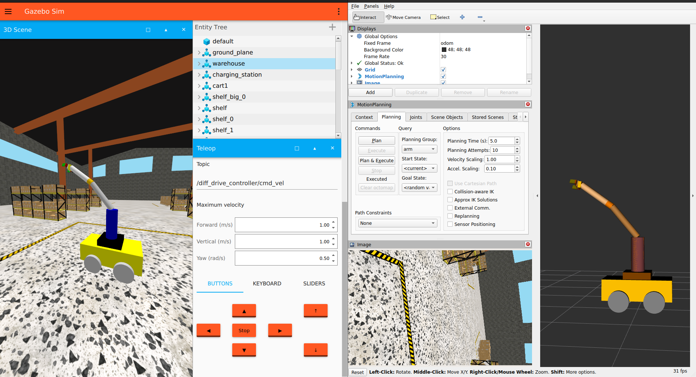

# 6DOF Robot Arm on a Mobile Base



## Overview

This workspace contains ROS 2 packages for a 6DOF robot arm mounted on a mobile base, including robot description, bringup launch files, and MoveIt configuration for planning and visualization.

## Packages

- `my_robot_description`
  - URDF/Xacro robot model: links, joints, visuals, and collision geometry.
  - RViz config for robot display (`rviz/robot_display.rviz`).
  - Launch file: `launch/display.launch.py` (spawns robot model for visualization).

- `my_robot_bringup`
  - Integration launchers for bringing up the system on a physical or simulated robot.
  - Includes Gazebo bridge and simulation integration.
  - Controller configs in `config/ros2_controllers.yaml` with:
    - `arm_controller` (JointTrajectoryController, joints joint1..joint6)
    - `gripper_controller` (JointTrajectoryController, gripper_left_finger_joint)
    - `joint_state_broadcaster`
    - `diff_drive_controller` (differential-drive base joints)
  - Launch files:
    - `launch/platform.launch.py` (base/arm controllers and state publishers)
    - `launch/gazebo.launch.py` (Gazebo simulation + robot spawn + bridge + controller spawn + move_group)

- `arm_moveit_config`
  - MoveIt 2 setup for motion planning and manipulation.
  - Includes planning configuration, controllers, and MoveIt launch files.
  - `launch/demo.launch.py`, `launch/move_group.launch.py`, `launch/moveit_rviz.launch.py`, `launch/rsp.launch.py`, `launch/spawn_controllers.launch.py`, `launch/static_virtual_joint_tfs.launch.py`, `launch/warehouse_db.launch.py`.

- `platform_movit_config`
  - Mobile-platform MoveIt config integrating a differential-drive base and 6DOF arm.
  - Includes mobile base controllers (differential drive) plus the arm MoveIt planning configurations.
  - Same set of MoveIt launch files as `arm_moveit_config` for a mobile base context.

## Key launch files

- `ros2 launch my_robot_bringup gazebo.launch.py`
   - Launch the platform in empty gazebo world and move group.

- `ros2 launch my_robot_description display.launch.py`
  - Load and visualize the robot model in RViz.

- `ros2 launch my_robot_bringup platform.launch.py`
  - Start robot state publishers, controller managers, and base/platform integration.

- `ros2 launch arm_moveit_config demo.launch.py`
  - Full MoveIt demo including RViz and move_group interaction.

- `ros2 launch platform_movit_config demo.launch.py`
  - Full MoveIt demo for the platform (Mobile base + Robot Arm) including RViz and move_group interaction.

## Quick start

1. Source ROS 2 and workspace:

```bash
source /opt/ros/<distro>/setup.bash
source install/setup.bash
```

2. Visualize model:

```bash
ros2 launch my_robot_description display.launch.py
```

3. Start MoveIt demo (arm+gripper):

```bash
ros2 launch arm_moveit_config demo.launch.py
```

Or

3. Start MoveIt demo (Platform):

```bash
ros2 launch platform_movit_config demo.launch.py
```

## TODO

- [ ] Add 3D sensors (Lidar/Depth Camera)
